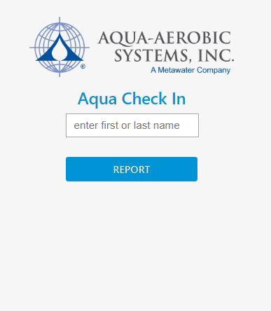
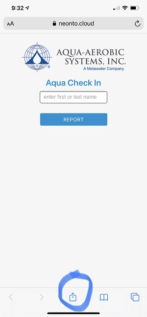
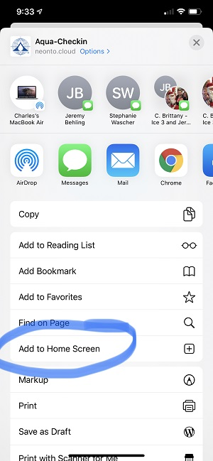
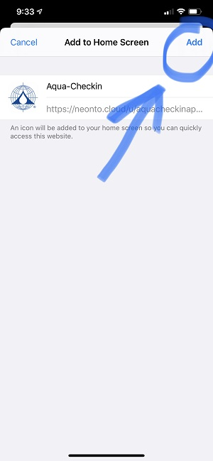

# Aqua-Checkin App
 
The Aqua-CheckIn App helps Aqua employees easily check-in each morning from their computer, phone or tablet.  
The report created from the Aqua-CheckIn App will be used to account for all Aqua employees in an emergency evacuation. 
 

## How to use Aqua-Checkin App
- Once app loads begin typing in your first or last name in textbox until your name appears
- Tap/Click <b>Here</b> button
- If successful, you will receive a pop-up confirmation 
- That's it!

## How to view Aqua-Checkin App Report
- Once app loads click on the <b>Report</b> button
- The report will only show checkins for tha day

## How to setup Aqua-Checkin App

### Computer/Laptop 

1) Go to [http://bit.ly/aquacheckin](http://bit.ly/aquacheckin) from the Chrome web browser 
2) Click the Chrome menu on the browser toolbar. 
3) Select <b>More Tools</b>. 
4) Select <b>Createshortcut</b> and checkbox <b>Open as Window</b>. 
5) Click <b>Create</b>.  

To view your Chrome apps click on the <b>Show Apps</b> icon 
 

### iPhone 
1) Open [http://bit.ly/aquacheckin](http://bit.ly/aquacheckin) from Safari web browser 
2) Tap the <b>Share</b> button at the bottom of the page. It looks like a square with an arrow pointing out of the top. 
3) In the list of options that appears, scroll down until you see <b>Add to Home Screen</b>. Tap this. 
4) Click <b>Add</b> when you’re done. 
 
See Picture Steps below on how to add iPhones home screen  
1) Tap arrow icon on bottom of iphone (see circled icon) 
 
2) Tap <b>Add to Home Screen</b> (see circled icon) 
 
2) Tap <b>Add</b> (see circled icon) 
 

### Android 
1) Open [http://bit.ly/aquacheckin](http://bit.ly/aquacheckin) from the Chrome web browser 
2) Tap on the <b>Menu</b> button. The looks of the Menu button will depend on your device; usually it's an app button that looks like  three horizontal lines stacked on each other, or it could be accessed through a hardware button on your phone. 
3) Tap <b>Add to Home Screen</b>, Done! A shortcut to the website will be added to your home screen. 
